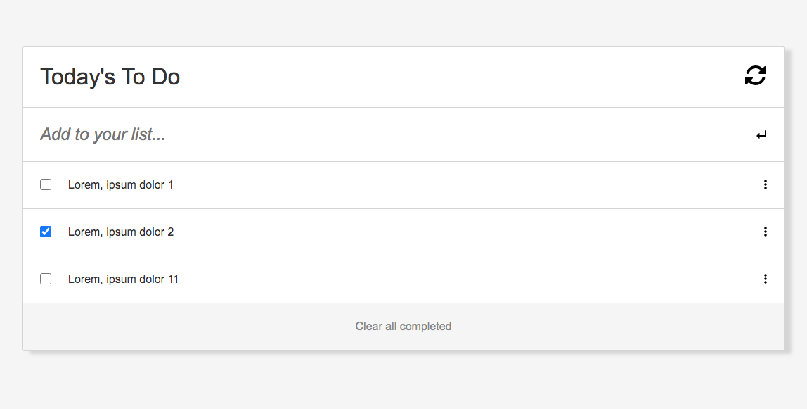

  
  <h3><b>To Do List</b></h3>

<!-- TABLE OF CONTENTS -->

# 📗 Table of Contents

- [📗 Table of Contents](#-table-of-contents)
- [📖 To Do List ](#-to-do-list-)
  - [🛠 Built With ](#-built-with-)
    - [Tech Stack ](#tech-stack-)
    - [Key Features ](#key-features-)
  - [🚀 Live Demo ](#-live-demo-)
  - [💻 Getting Started ](#-getting-started-)
    - [Prerequisites](#prerequisites)
    - [Setup](#setup)
    - [Install](#install)
    - [Usage](#usage)
  - [👥 Author ](#-author-)
  - [🔭 Future Features ](#-future-features-)
  - [🤝 Contributing ](#-contributing-)
  - [⭐️ Show your support ](#️-show-your-support-)
  - [🙏 Acknowledgments ](#-acknowledgments-)
  - [❓ FAQ (OPTIONAL) ](#-faq-optional-)
  - [📝 License ](#-license-)

<!-- PROJECT DESCRIPTION -->

# 📖 To Do List 

**To Do List** is a web page where the user can see a list of todos, they can also add or remove todos to the list. Todos are saved to local storage.

## 🛠 Built With 

### Tech Stack 

  
Client

  <ul>
    <li><a href="https://www.javascript.com/">JavaScript</a></li>
  </ul>
  <ul>
    <li><a href="https://html.com/">Html</a></li>
  </ul>
  <ul>
    <li><a href="hhttps://www.w3schools.com/css/">CSS</a></li>
  </ul>

  
Server

  <ul>
    <li><a href="#">N/A</a></li>
  </ul>

Database

  <ul>
    <li><a href="https://developer.mozilla.org/en-US/docs/Web/API/Window/localStorage">LocalStorage</a></li>
  </ul>

<!-- Features -->

### Key Features 

- **To Do List lets the user see and update a list of todos**
- **To Do List allows the user to add or remove any todo from the list**
- **To Do List stores all data in Local Storage so the user never loses the todo list**

(<a href="#readme-top">back to top</a>)

<!-- LIVE DEMO -->

## 🚀 Live Demo 

- [To Do List](https://dennis-every.github.io/to-do-list/dist/)

(<a href="#readme-top">back to top</a>)

<!-- GETTING STARTED -->

## 💻 Getting Started 

To get a local copy up and running, follow these steps.

### Prerequisites

In order to run this project you need:

- A working computer.
- Connection to internet.

### Setup

Clone this repository to your desired folder:

- use git clone https://github.com/dennis-every/to-do-list.git
- Open the files in your text editor.

### Install

You don't need to install anything.

### Usage

To run the project, execute the following command:

- Go to the file called index.html.
- Right click Open Live Server.

(<a href="#readme-top">back to top</a>)

<!-- AUTHOR -->

## 👥 Author 

👤 **Dennis Every**

- GitHub: [@dennis-every](https://github.com/dennis-every)

(<a href="#readme-top">back to top</a>)

<!-- FUTURE FEATURES -->

## 🔭 Future Features 

- [ ] **None planned**

(<a href="#readme-top">back to top</a>)

<!-- CONTRIBUTING -->

## 🤝 Contributing 

Contributions, issues, and feature requests are welcome!

Feel free to check the [issues page](../../issues/).

(<a href="#readme-top">back to top</a>)

<!-- SUPPORT -->

## ⭐️ Show your support 

If you like this project feel free to fork it and use it as you need.

(<a href="#readme-top">back to top</a>)

<!-- ACKNOWLEDGEMENTS -->

## 🙏 Acknowledgments 

I would like to thank Microverse for the information provided to build this project.

(<a href="#readme-top">back to top</a>)

<!-- FAQ (optional) -->

## ❓ FAQ (OPTIONAL) 

- **Can I use the project for any purpose?**

  - Yes, you can use this files for anything you need.

- **Is the information saved in any database?**

  - No, all data is saved in Local Storage.

(<a href="#readme-top">back to top</a>)

<!-- LICENSE -->

## 📝 License 

This project is [MIT](./MIT.md) licensed

(<a href="#readme-top">back to top</a>)

